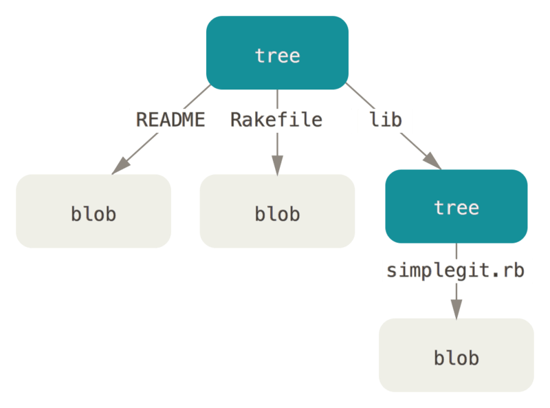

The two types of git sub commands available in git due to the early use of git being a toolkit for version control system rather than a complete VCS itself
git plumbing commands are designed to be chained with form scripts and the more commonly used commands are called porcelain
git innit creates a .git file which stores all the information about everything that is used by git
the file contains 

Git is basically a key-value store for you, write anything on git and it will give you a key that you can access later in time to retrieve that version 
or the data

        1). description: used by the GitWeb so not needed to be modified or changed 
        2). config: the configuration required by default 
IMPORTANT
        1). HEAD: the reference that points to main branch that you are on 
        2). objects: this directory has all the content for your database
        3). refs: contains the pointer to commit objects for data
        4). index is where git stores all the staging area information

So the tool we are making has to implement this low level implementation
   commands->  git hash-object: this took some data and stored it in .git/objects giving you back a unique key 

How the internals work:
    -> git hash-object crates a file in objects(blob to be precise) that is stored inform of first two bits being file name and the rest data being file data
    -> git cat-file shows you the text given that you give the key value and can tell you the file type
Another way git arranges files is a tree in this way 

How is the tree being made:
    -> the  